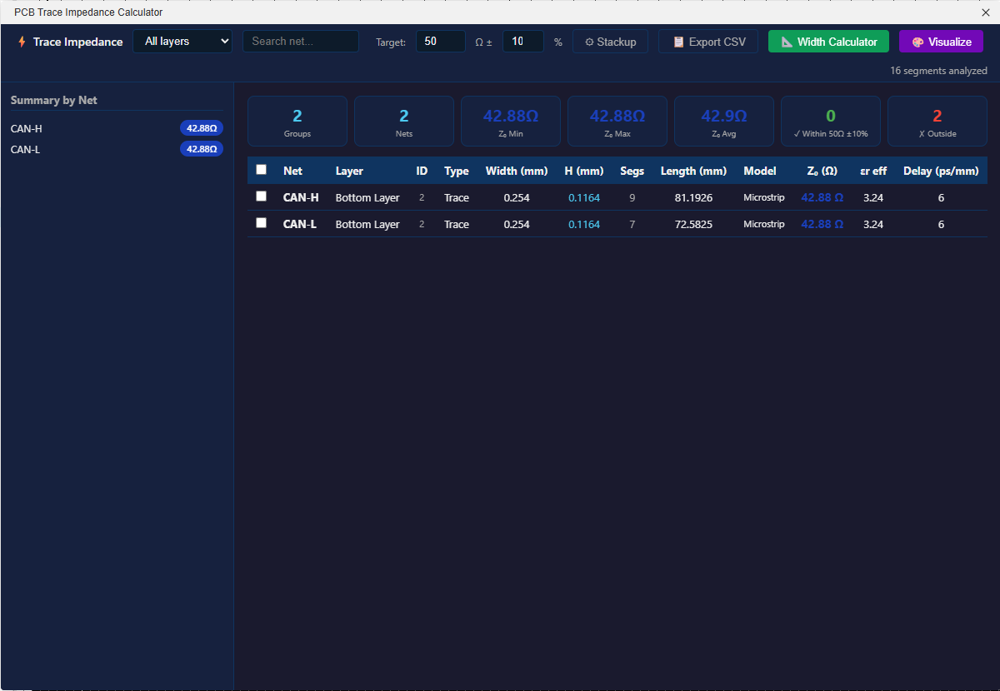
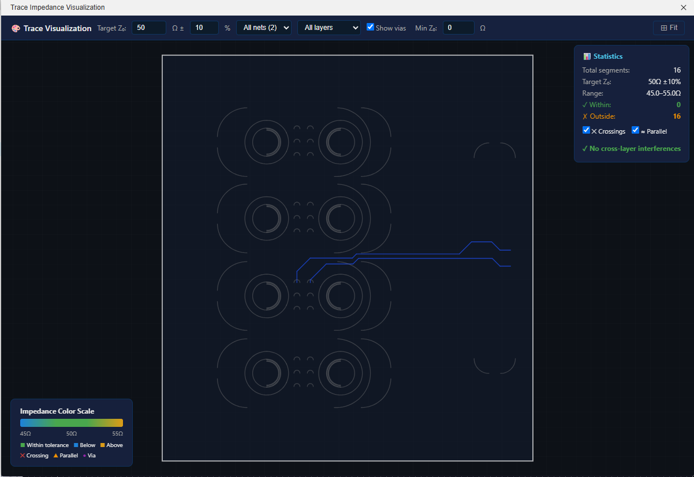

# PCB Trace Impedance Calculator — EasyEDA Pro Extension

An EasyEDA Pro extension that calculates the characteristic impedance (Z₀) of every trace segment on a PCB, using established RF/signal-integrity formulas (Hammerstad & Jensen for microstrip, Cohn/Wheeler for stripline, Kirschning & Jansen for differential microstrip). Reference standard: IPC-2141A.





## Features

- **Automatic extraction** of all lines, arcs, vias, pads and copper zones from the active PCB via the EasyEDA `eda.pcb_Primitive*` API.
- **Per-segment impedance** — each trace is classified by layer (microstrip or stripline) and its Z₀, effective εr and propagation delay are computed.
- **Filtering** by layer and free-text search.
- **Summary cards** showing group count, net count, min/max/avg Z₀ with continuous gradient colors.
- **Net-level sidebar** with per-net average impedance.
- **Quick Calculator** for ad-hoc microstrip / stripline computations.
- **Impedance Reference Table** for common protocols (USB, HDMI, Ethernet, DDR, PCIe, etc.).
- **Stackup editor** — adjust dielectric constant (εr), copper thickness, board thickness and per-layer height/type. Includes manufacturer presets (JLCPCB, standard) and visual cross-section diagram.
- **Persistent settings** — stackup configuration saved to EasyEDA storage, survives reloads.
- **CSV export** of all results (including H per segment).
- **Cross-layer interference detection** — warns when traces on different layers cross or run parallel nearby, indicating potential impedance alteration from capacitive coupling.
- **Trace Visualization** — separate fullscreen canvas view rendering all traces color-coded by impedance. Includes target Z₀ selection, tolerance %, Min Z₀ filter, crossing markers, via display, pan/zoom, and hover info.
- **Select & visualize** — checkbox selection on table rows with "View Selected" and "Clear Selected" buttons.
- **Dark mode** UI.

## Architecture

```
easyeda-impedance-calculator/
├── extension.json                  # Extension manifest (SDK v3.0.0)
├── dist/
│   └── index.js                    # Entry point — PCB data extraction + iframe launcher
├── iframe/
│   ├── index.html                  # Full UI (toolbar, sidebar, results table, settings)
│   ├── trace-viz.html              # Trace visualization — canvas renderer with impedance color coding
│   └── impedance-calc.js           # Impedance calculation engine (IIFE)
└── locales/
    ├── en.json                     # i18n strings for the extension runtime
    └── extensionJson/
        └── en.json                 # i18n strings for extension.json menu titles
```

### extension.json

Defines the extension metadata, SDK version (`engines.eda: "^3.0.0"`), and registers a **Trace Impedance** header menu in the PCB editor with two commands:

| Menu Item | Function | Description |
|---|---|---|
| Calculate Impedance… | `runImpedanceCalc` | Extracts PCB data and opens the analysis iframe |
| About… | `about` | Shows version/info dialog |

### dist/index.js

Uses the `edaEsbuildExportName` IIFE wrapper (the standard EasyEDA Pro build format). Exports:

- **`activate()`** — called when the extension loads (no-op).
- **`runImpedanceCalc()`** — calls `extractPCBData()`, stores the result via `eda.sys_Storage.setExtensionUserConfig()`, then opens the iframe UI with `eda.sys_IFrame.openIFrame()`.
- **`about()`** — shows a dialog with version and description.

`extractPCBData()` reads all primitives through the EasyEDA API:

| API Call | Data |
|---|---|
| `eda.pcb_PrimitiveLine.getAll()` | Trace segments (net, layer, width, start/end coords) |
| `eda.pcb_PrimitiveArc.getAll()` | Arc segments |
| `eda.pcb_PrimitiveVia.getAll()` | Vias (net, layers, hole/ring size) |
| `eda.pcb_PrimitivePad.getAll()` | Pads |
| `eda.pcb_PrimitivePour.getAll()` | Copper pours / zones |

All coordinates are in **mils** internally; the extension converts to **mm** using `MIL_TO_MM = 0.0254`.

### iframe/impedance-calc.js

A self-contained IIFE (`window.ImpedanceCalc`) exposing:

| Function | Model | Formula Source |
|---|---|---|
| `microstrip(w, h, t, er)` | Microstrip | Hammerstad & Jensen |
| `stripline(w, b, t, er)` | Stripline | Cohn / Wheeler |
| `differentialMicrostrip(w, h, t, s, er)` | Differential Microstrip | Kirschning & Jansen |
| `analyzeAll(pcbData, stackup)` | Batch analysis | Iterates all segments, picks model by layer |

Layer detection is **fully dynamic** — the engine discovers copper layers at runtime from traces and copper pours. Known non-copper layers (3–14: silkscreen, solder mask, paste, outline, etc.) are excluded. Any other layer ID found in the PCB data is treated as a copper layer.

Physical ordering: **Top (1) → inner layers (sorted by ID) → Bottom (2)**.

| Layer ID | Name | Notes |
|---|---|---|
| 1 | TopLayer | Always first (microstrip) |
| 2 | BottomLayer | Always last (microstrip) |
| 15, 16, … | InnerLayer1, InnerLayer2, … | Auto-detected, named by sorted position |
| 3–14 | Non-copper | Silkscreen, solder mask, paste, outline — filtered out |

### iframe/index.html

Single-page UI loaded inside the EasyEDA iframe. On load it reads PCB data from `eda.sys_Storage.getExtensionUserConfig()`, runs the impedance analysis, and renders:

1. **Toolbar** — net/layer filters, search, reload, stackup settings, CSV export, theme toggle.
2. **Sidebar** — per-net Z₀ summary, quick calculator, protocol reference table.
3. **Main area** — summary cards (segments, nets, Z₀ min/max/avg) and a full results table.
4. **Settings modal** — edit global εr, copper thickness, and per-layer type/height/εr.

## How It Was Built

1. **Reference study** — The `pcb-current-density-sim_v2.0.0.eext` extension was reverse-engineered to understand the correct EasyEDA Pro extension format: `extension.json` manifest, `edaEsbuildExportName` wrapper, `eda.*` API namespace, iframe-based UI, and `.eext` packaging.

2. **Manifest** — `extension.json` was written following the reference format with `engines.eda: "^3.0.0"`, `headerMenus.pcb` for PCB editor integration, and an `entry` pointing to `./dist/index`.

3. **Data extraction** — `dist/index.js` uses `eda.pcb_PrimitiveLine.getAll()` and related calls to extract every trace, arc, via, pad and pour from the board. Data is passed to the iframe via `eda.sys_Storage`.

4. **Impedance engine** — Classical closed-form formulas were implemented in `impedance-calc.js`: Hammerstad & Jensen for microstrip Z₀ and effective εr, Cohn/Wheeler for stripline, Kirschning & Jansen for differential pairs. Propagation delay is derived from εr_eff.

5. **UI** — A responsive single-page HTML/CSS/JS interface with dark/light themes, filtering, a quick calculator for manual checks, and CSV export.

6. **Packaging** — All files are zipped at the root level using .NET `System.IO.Compression.ZipFile` (not PowerShell `Compress-Archive`, which writes backslash paths) and renamed from `.zip` to `.eext`. The ZIP specification requires **forward-slash** (`/`) path separators; backslashes cause EasyEDA Pro to silently fail to load the extension.

## Building the .eext

Use .NET's `ZipFile` API to ensure forward-slash paths (ZIP spec requirement):

```powershell
Add-Type -AssemblyName System.IO.Compression.FileSystem
Add-Type -AssemblyName System.IO.Compression

$src = "path\to\easyeda-impedance-calculator"
$out = "trace-impedance-calculator.eext"

$zip = [System.IO.Compression.ZipFile]::Open($out, [System.IO.Compression.ZipArchiveMode]::Create)
Get-ChildItem -Path $src -Recurse -File | ForEach-Object {
    $entry = $_.FullName.Substring($src.Length + 1).Replace('\', '/')
    [System.IO.Compression.ZipFileExtensions]::CreateEntryFromFile(
        $zip, $_.FullName, $entry,
        [System.IO.Compression.CompressionLevel]::Optimal) | Out-Null
}
$zip.Dispose()
```

> **Warning:** Do NOT use PowerShell `Compress-Archive` — it writes backslash paths (`dist\index.js`) which EasyEDA Pro cannot read.

## Installation

1. Build the `.eext` file using the script above (or download a pre-built release).
2. In EasyEDA Pro, go to **Extensions → Extension Manager → Load Extension** and select the `.eext` file.
3. Open a PCB document. The **Trace Impedance** menu will appear in the header menu bar.

## Usage

1. Open a PCB in EasyEDA Pro.
2. Click **Trace Impedance → Calculate Impedance…**
3. The extension extracts all trace data, computes impedance for each segment, and opens the results panel.
4. Use the search box and layer filter to narrow results.
5. Click **⚙ Stackup** to adjust dielectric properties for your board.
6. Click **📋 Export CSV** to download the full analysis.
7. Select traces with checkboxes and click **🎨 View Selected** to visualize only those traces. Use **✖ Clear Selected** to deselect all.

## Changelog

### v1.13.6 — Board Outline, Arc Hover, Color Update & Cleanup

- **Board outline in Trace Visualization** — the PCB board outline is now extracted and rendered on the canvas (dark background fill + white stroke), providing spatial context for trace layout.
- **Arc hover tooltip** — hovering over curved trace segments in Trace Visualization now shows Z₀, net, layer and width (previously only straight segments had hover info).
- **Loading overlay** — spinner with "Loading PCB data…" displayed while the visualization canvas initializes, preventing a blank screen.
- **Color scale update** — replaced red with amber (#E8A317) for above-target impedance values. Red implied a problem, but above-target impedance is not inherently bad. Red is now reserved only for crossing markers (actual issues). Net selection highlight also changed to amber.
- **Removed debug buttons** — debug export removed from Trace Visualization (was added in v1.11.1).

### v1.13.4 — UI Cleanup & Gradient Colors

- **Continuous gradient coloring** for Z₀ values in the table, sidebar badges and summary cards (blue → green → red based on target/tolerance).
- **Min Z₀ filter** in the Trace Visualization toolbar — hides traces below the specified impedance from the canvas.
- **Crossing + Parallel legend** in Trace Visualization now shows both markers: ✕ Crossing (red X) and ▲ Parallel (orange triangle).
- **Removed** Apply button from Trace Visualization toolbar (inputs already auto-update).
- **Removed** Debug Export button and Reload button from main UI.
- **Removed** net-filter dropdown (use search box instead).
- **Removed** light/dark theme toggle — dark mode is now the default.
- **Clear Selected button** (✖) appears alongside View Selected to quickly deselect all traces.
- **Fixed page scroll** — main UI now uses flexbox layout with `overflow: hidden` on body, eliminating unwanted full-page scrollbar.
- Reduced card sizes and toolbar padding for more compact layout.

### v1.13.3 — Trace Selection & Grouped Summary Cards

- **Summary cards now count by group** instead of individual segments. The first card shows "Groups" (unique net+layer+width+Z₀ combinations) rather than raw segment count. Within/outside tolerance counts also reflect grouped rows.
- **Checkboxes on table rows** — each grouped trace row has a checkbox for selection. A "Select All" checkbox in the header toggles all visible rows.
- **"View Selected" button** — appears in the toolbar when at least one group is selected, showing the count. Clicking it opens the Trace Visualization with only the selected traces (filtered pcbData), allowing focused inspection of specific nets/layers.

### v1.13.2 — Grouped Trace Table

- **Traces with same net, layer, width and Z₀ are now merged** into a single row in the results table. A new **Segs** column shows the segment count, and **Length** shows the total combined length. Traces with the same net but different impedance remain as separate rows.
- **CSV export** also uses grouped data with the same Segments and total Length columns.
- Reduces table clutter significantly for boards with hundreds/thousands of trace segments.

### v1.13.1 — Stripline Formula Fix (Thickness Correction)

- **Fixed stripline impedance calculation** — removed the IPC-2141A wEff thickness correction which added ~19% to trace width for thin copper (0.5oz = 0.0152mm inner layers), causing ~9% Z₀ error on stripline layers. The `+t` term in the IPC formula denominator already accounts for thickness to first order. Without the explicit correction, stripline Z₀ error vs JLCPCB's Polar Si9000 field solver drops from **8.6% to 0.2%**.
- **Removed offset stripline parallel-microstrip path** — the previous asymmetric stripline fallback (parallel combination of two microstrip impedances) was physically incorrect for homogeneous dielectric striplines. The IPC centered formula with full b (plane-to-plane) is now used for all stripline geometries, which is accurate to <1% for typical PCB offset ratios.
- Verification: 8L Inner2 (w=0.1478mm): 54.30Ω vs JLCPCB 54.42Ω (−0.2%). Width Calculator now gives 0.147mm vs JLCPCB 0.148mm (−0.5%) instead of the previous 0.120mm (−19%).

### v1.13.0 — JLCPCB Impedance Calculator Accuracy Alignment

Three corrections to match JLCPCB's official impedance calculator parameters (Polar Si9000 field solver):

1. **Outer copper thickness** — updated from 0.035mm (1oz nominal) to **0.04064mm** (1.6 mil finished after plating), matching JLCPCB's impedance calculator convention for 1oz finished copper.
2. **Per-gap εr** — each dielectric gap now uses its own εr value (prepreg vs core) instead of a single εr for the entire stackup. For example, the 8L preset now correctly uses εr=4.16 (2116 prepreg), εr=3.91 (1080 prepreg), and εr=4.41 (0.3mm core) for different gaps. Inner layers compute a distance-weighted average εr from the gaps to their reference planes.
3. **Soldermask & etch taper NOT applied** — JLCPCB's user guide documents soldermask (εr=3.8, 0.6mil over Cu) and etch taper (top width = base − 0.7mil). However, testing against JLCPCB's field solver results showed these two effects partially cancel each other (+2Ω etch vs −0.5Ω SM), and analytical approximations are too imprecise — the raw Hammerstad & Jensen formula already gives **<1% error** vs JLCPCB. Applying crude corrections actually worsened accuracy from 0.7% to 2.8%.

Also updated the stackup cross-section display to show per-gap εr values and the Width Calculator copper thickness reference.

### v1.12.3 — Summary Cards Update on All Filters

- **Summary cards now update on every filter change** — net dropdown, layer dropdown, and search text all refresh the summary cards (segments, nets, Z₀ min/max/avg, within/outside). Previously the cards only updated when changing target Z₀/tolerance or reloading.

### v1.12.2 — Inner Copper Thickness from JLCPCB Actual Data

- **Updated inner copper thickness** from nominal 0.5oz (0.0175mm) to **0.0152mm** (15.2µm) across all 4L/6L/8L presets, matching the actual finished thickness from JLCPCB’s physicalStacking JSON exports.
- All gaps and outer copper (0.035mm / 1oz) confirmed correct against official JLCPCB layer data.

### v1.12.1 — Filtered Summary Cards & Width Calculator Min-Width Warning

- **Summary cards now reflect active filters** — when filtering by net name, layer, or search text, the summary cards (Segments, Nets, Z₀ Min/Max/Avg, Within/Outside tolerance) update to show only the filtered results instead of the full board totals.
- **Width Calculator <4 mil warning** — when the calculated trace width is below 4 mils (0.1016mm), a red warning is displayed indicating that most PCB manufacturers (including JLCPCB) may not be able to fabricate the trace.

### v1.12.0 — Target Impedance Filter, Layer Sort Fix & Search Optimization

- **Target Z₀ + tolerance inputs on main screen** — new toolbar fields to set target impedance and ±% tolerance. The results table highlights segments in **green** (within tolerance) or **red** (outside tolerance). Summary cards now show within/outside counts.
- **Fixed layer dropdown ordering** — layer filter dropdowns in both the main screen and Trace Visualization now follow the physical stackup order (Top → Inner1 → Inner2 → … → Bottom) instead of string-sorted layer IDs, which incorrectly placed BottomLayer before Inner6+ on 8+ layer boards.
- **Impedance Reference table moved to Width Calculator** — the protocol reference (USB, HDMI, Ethernet, etc.) is now inside the Width Calculator modal for quick access when calculating trace widths.
- **Debounced search** — net search input now uses a 250ms debounce instead of re-rendering on every keystroke, improving responsiveness with large trace counts.

### v1.11.2 — JLCPCB Dielectric Constant Calibration

- **Updated εr values** in all JLCPCB stackup presets to match the official [JLCPCB PCB Capabilities](https://jlcpcb.com/capabilities/pcb-capabilities) page:
  - **2-Layer**: εr 4.6 → **4.5** (FR-4 standard)
  - **4-Layer 7628**: εr 4.6 → **4.4** (7628 Prepreg Dk)
  - **6-Layer 3313**: εr 4.05 → **4.1** (3313 Prepreg Dk)
  - **8-Layer 2116**: εr 4.29 → **4.16** (2116 Prepreg Dk)
- All impedance calculations now use manufacturer-verified dielectric constants for improved accuracy.

### v1.11.1 — Inner Copper Thickness Fix, Trace-Viz Debug & Crossing Filter Fix

- **Fixed inner copper thickness** — inner layers now correctly use 0.5oz (0.0175mm) instead of 1oz (0.035mm). Outer layers (Top/Bottom) remain 1oz. Width Calculator and stackup display updated to show per-layer Cu thickness.
- **Debug export in Trace Visualization** (🐛) — new button exports diagnostic data (stackup, crossings, traces on filtered layer, layer breakdown) to clipboard for troubleshooting crossing issues.
- **Fixed crossing filter logic** — when a layer is selected, crossings now correctly require at least one segment on the selected layer itself (not just its neighbor group). Also fixed missing stackup parameter in trace-viz `detectCrossings` call, so plane shielding now works in the visualizer.

### v1.11.0 — Auto-Preset, Width Calculator & Adjacent-Layer Crossing Filter

- **Auto-select stackup preset** — the extension now automatically detects the board's copper layer count and selects the matching JLCPCB preset (2L, 4L, 6L, 8L). Manual override via ⚙ Stackup settings is still available.
- **Width Calculator** (📐) — new modal to reverse-calculate the trace width needed for a target impedance. Select a layer, enter the desired Z₀, and get the required width (mm and mils). Uses bisection on the Microstrip/Stripline formulas.
- **Removed Quick Calculator** from the sidebar (replaced by the Width Calculator button).
- **Adjacent-layer crossing filter** in Trace Visualization — when a layer is selected in the filter dropdown, only crossings involving that layer and its immediate neighbors in the stackup are shown. For example, selecting Top Layer shows only crossings between Top and Inner1; selecting Inner2 shows crossings between Inner1 and Bottom.
- Crossing counts and the warning list in the stats panel also update with the filter.

### v1.10.1 — Trace Visualization Orientation Fix

- **Fixed 180° flipped board orientation** in the Trace Visualization canvas — the Y-axis is now correctly inverted so the PCB renders in the standard top-down view matching EasyEDA's orientation.
- Pan, zoom, hover detection, grid drawing, and arc rendering all updated to match the corrected coordinate system.

### v1.10.0 — Plane-Shielded Cross-Layer Filtering

- **Cross-layer interference now considers reference plane shielding** — if a ground/power plane exists between two layers in the physical stackup, traces crossing on those layers are no longer flagged as interference. For example, in a 4-layer board with L1=signal, L2=GND plane, L3=signal, L4=signal: traces on L1 crossing traces on L3 are shielded by the L2 GND plane and are NOT reported. However, traces on L3 crossing traces on L4 (no plane between them) ARE reported.
- Only "pure planes" (layers with copper pour but no signal traces) count as shielding — mixed layers with both traces and pour do not shield.

### v1.9.0 — Accurate JLCPCB Presets from EasyEDA Layer Export

- **Replaced all 4L+ presets** with data extracted directly from JLCPCB's EasyEDA physicalStacking JSON exports, using exact dielectric thicknesses from the manufacturer layer data.
- **4-Layer JLC04161H-7628**: PP 7628 0.2104 / Core 1.065 / PP 7628 0.2104, εr=4.6
- **6-Layer JLC06161H-3313**: PP 3313 0.0994 / Core 0.55 / PP 2116 0.1088 / Core 0.55 / PP 3313 0.0994, εr=4.05
- **8-Layer JLC08161H-2116**: PP 2116 0.1164 / Core 0.3 / 2×PP 1080 0.1528 / Core 0.3 / 2×PP 1080 0.1528 / Core 0.3 / PP 2116 0.1164, εr=4.29
- **Fixed copper layer detection** — changed from blacklist to whitelist: only layers 1 (Top), 2 (Bottom), and 15-46 (Inner1-32) are treated as copper. Non-copper layers like "Pin Floating Layer" (51) no longer pollute the stackup.
- Total presets: 4 (2L, 4L, 6L, 8L) — all from verified JLCPCB 1.6mm data

### v1.8.0 — Extended JLCPCB Stackup Presets

- **6 new JLCPCB stackup presets** from official manufacturer specifications, covering 4L through 8L thin boards:
  - **4L-0.4mm-3313** (JLC04041H) — 4-layer 0.4mm, prepreg 3313, εr=4.05
  - **6L-0.57mm-3313** (JLC06061H) — 6-layer 0.57mm, prepreg 3313, εr=4.05
  - **6L-0.59mm-1080** (JLC06061H) — 6-layer 0.59mm, prepreg 1080/2116 mix, εr=3.63
  - **8L-0.76mm-1080** (JLC08081H) — 8-layer 0.76mm standard, prepreg 1080/2116, εr=3.63
  - **8L-0.85mm-1080A** (JLC08081H) — 8-layer 0.85mm special, double prepreg 1080, εr=3.63
  - **8L-0.8mm-1080B Tg170** (JLC08081H) — 8-layer 0.8mm Tg170, prepreg 1080/2313, εr=3.58
- All gap values computed from JLCPCB published layer-by-layer thickness data (prepreg + core dimensions)
- εr values use outer prepreg Dk (1080≈3.63, 3313≈4.05, 1080-Tg170≈3.58) — note: inner stripline layers may see slightly different εr from cores
- Total presets: 10 (2L, 4L×3, 6L×3, 8L×3)

### v1.7.0 — API Layer Detection & Probe Cleanup

- **Auto-detect copper layer count** — uses `eda.pcb_Layer.getTheNumberOfCopperLayers()` to reliably determine the board's copper layer count (2L, 4L, 6L, etc.) directly from EasyEDA's API. No longer relies solely on counting layers with traces/pours.
- **Real layer names from API** — uses `eda.pcb_Layer.getAllLayers()` to get the actual layer names configured in EasyEDA (e.g., "Top Layer", "Inner Layer 1") instead of hardcoded names.
- **Improved preset mismatch warning** — compares the selected JLCPCB preset layer count against the API-reported copper count (more reliable than the detected-from-traces count). Warning message now suggests changing the preset.
- **API investigation conclusion** — exhaustive probing of the EasyEDA Pro Extension SDK v3.0.0 confirmed that **stackup/dielectric thickness data is NOT exposed** by the API. The `pcb_Layer` namespace only provides display properties (color, visibility, lock). The `pcb_ManufactureData.getManufactureData()` endpoint is restricted to enterprise/private deployments. JLCPCB preset-based stackup remains the correct approach.
- **Removed API probe code** — all temporary API discovery code from v1.6.1 debug builds has been removed. Production-ready clean code.

### v1.6.1 — Plane-with-Traces Fix & Stripline Formula Rewrite — when a layer has BOTH a copper pour (e.g., GND fill) AND routed signal traces, the traces were not being analyzed. The layer was classified as a pure reference plane (`type: null`), causing `analyzeAll()` to skip all traces on it. Now, a layer is only classified as a pure plane if it has copper pours but **no signal traces**. Layers with both traces and pours are still used as reference planes for adjacent layers, but their traces get impedance calculated normally.
- **Fixed: Stripline Z₀ formula** — replaced the broken Cohn/Wheeler wide-strip formula (which produced unrealistically low Z₀, e.g., 4.54Ω instead of ~18Ω) with:
  - **Centered stripline**: IPC-2141A standard formula `Z₀ = (60/√εr) × ln(1.9b / (0.8Wₑ + t))`, accurate for all practical W/b ratios.
  - **Offset stripline**: when the trace is significantly off-center (asymmetry ratio > 2:1), uses a dual-microstrip parallel combination — computes microstrip Z₀ to each plane independently and combines: `Z₀ = 1/(1/Z₁ + 1/Z₂)`. Reports model as "Offset Stripline".
- **Improved: Thickness correction** for stripline effective width, using the standard Hammerstad formula for both wide and narrow traces.

### v1.6.0 — Cross-Layer Interference Detection, Trace Visualization & Target Impedance

- **Cross-layer interference detection** — new `detectCrossings()` algorithm detects when traces on different layers cross or run close in parallel (within 3× trace width). Warns that impedance may be affected by capacitive coupling. Results shown as:
  - An **orange warning banner** in the main calculator screen with the number of interferences found.
  - Detailed **crossing markers** on the visualization canvas (✕ for crossings, ▲ for parallel runs).
  - A **scrollable warning list** in the visualization info panel showing each pair of interfering nets/layers.
- **Trace Visualization screen** — new **🎨 Visualize** button opens a separate fullscreen canvas view (`trace-viz.html`) that renders all PCB traces in real time:
  - **Impedance color coding** — traces colored by impedance relative to a user-defined target. Green = within tolerance, red = outside tolerance.
  - **Target Z₀ selector** — input fields for target impedance (default 50Ω) and tolerance percentage (default ±10%). Highlights problem areas instantly.
  - **Interactive canvas** — pan (drag), zoom (scroll wheel), hover to see trace info (Z₀, net name).
  - **Grid overlay** with auto-scaling grid spacing.
  - **Crossing markers** — red ✕ for cross-layer crossings, orange ▲ for parallel runs. Toggle on/off.
  - **Via markers** — purple dots showing via locations. Toggle on/off.
  - **Statistics panel** — shows total segments, segments within/outside tolerance, crossing count.
  - **Net and layer filters** — filter which traces are displayed on the canvas.
  - **Fit button** — auto-fits the view to show all traces.
  - **Dark / Light theme** toggle.
  - **Color legend** with gradient bar showing the impedance scale.
- **Data flow** — visualization reads PCB data and stackup preset from the same `eda.sys_Storage` keys used by the main calculator. No duplicate extraction needed.

### v1.5.0 — Debug Export, Precision Fix & Smart Gap Merging

- **Debug Export button** — orange **🐛 Debug Export** button in the toolbar. Collects all raw PCB data (`lines`, `arcs`, `vias`, `pads`, `zones`), the computed `stackup` (layers, order, spacings, detected planes), and `analysisResults` (per-segment Z₀, summary, net summary). Copies the full JSON to clipboard, or opens a textarea if clipboard is unavailable. Useful for diagnosing incorrect readings.
- **Precision fix** — rounding function now uses 4 decimal places instead of 3. Previously, JLCPCB 7628 prepreg gap of 0.2104mm was rounded to 0.21mm, causing ~0.1Ω error in Z₀ calculations.
- **Smart gap merging** — when a layer expected by the preset is missing (e.g., no copper pour on InnerLayer1), the extension now maps detected layers to their expected positions in the preset and **sums adjacent gaps** instead of using a wrong fallback. Examples with 4-layer JLCPCB 7628 preset (gaps: 0.2104 / 1.065 / 0.2104 mm):
  - **3 layers detected** (layer 15 missing): Top→16 = 0.2104+1.065 = **1.2754mm**, 16→Bot = **0.2104mm**
  - **2 layers detected** (both inner missing): Top→Bot = 0.2104+1.065+0.2104 = **1.4858mm**
  - **4 layers detected** (all present): uses exact preset gaps **0.2104 / 1.065 / 0.2104mm**
- **Preset layer count mismatch warning** — status bar shows ⚠ warning when the number of detected copper layers doesn't match the selected preset (e.g., "preset expects 4 layers but only 3 detected").
- **Fixed: Reference plane type priority** — layers that are reference planes (copper pours) are now correctly identified before checking neighbor planes. Previously, GND planes could be misclassified as microstrip/stripline.
- **Fixed: Duplicate layer ID in detected planes** — removed redundant "(id:X)" text from the detected planes display.
- **Fixed: H hidden for reference planes** — plane layers now show "—" instead of an H value in the settings panel.

### v1.4.0 — JLCPCB-Only Presets, Auto-Recalc Fix & Layer Order Fix

- **JLCPCB-only stackup presets** — removed generic/custom presets. Settings now only show JLCPCB stackups:
  - 2-Layer 1.6mm (JLCPCB)
  - 4-Layer 1.6mm (JLCPCB 7628: 0.2104 / 1.065 / 0.2104 mm, εr=4.6)
  - 4-Layer 1.6mm (JLCPCB 3313: 0.0994 / 1.265 / 0.0994 mm, εr=4.05)
  - 6-Layer 1.6mm (JLCPCB 7628)
- **No manual configuration** — removed manual per-layer type/H/εr editing. All values are automatically calculated from the selected JLCPCB preset + detected PCB geometry. Settings panel shows read-only layer info.
- **Fixed: Save now immediately recalculates** — clicking "Apply" in settings now instantly recalculates all impedance values with the new preset. Previously, changes only took effect after clicking "Calculate Impedance" again from the menu.
- **Fixed: Inner layers now shown in correct physical order** — layers are displayed as Top → Inner1 → Inner2 → Bottom in the settings panel. Previously, JS numeric key iteration caused inner layers (id 15, 16) to appear after Bottom (id 2).
- **Preset εr applied per-layer** — each layer now uses the εr from the selected JLCPCB preset (e.g., 4.6 for 7628, 4.05 for 3313) instead of the old hardcoded 4.5.
- **Simplified storage** — only the preset key is persisted, not the full stackup. Preset choice survives reloads.

### v1.3.0 — Stackup Presets, Persistent Settings & H Column

- **Stackup presets** — dropdown with real manufacturer specs:
  - 2-Layer 1.6mm (Standard)
  - 4-Layer 1.6mm (Standard: 0.2 / 1.2 / 0.2 mm)
  - 4-Layer 1.6mm (JLCPCB JLC04161H-7628: 0.2104 / 1.065 / 0.2104 mm, εr=4.6)
  - 4-Layer 1.6mm (JLCPCB JLC04161H-3313: 0.0994 / 1.265 / 0.0994 mm, εr=4.05)
  - 6-Layer 1.6mm (Standard)
  - Custom (manual)
- **Board thickness input** — editable field in settings, passed to `buildStackup()` to recalculate all dielectric gaps proportionally.
- **Persistent stackup settings** — saved to `eda.sys_Storage` under key `impedance-calc-stackup`. Survives reloads and session restarts. Manual per-layer H overrides are preserved across recalculations.
- **H (mm) column** in results table — shows the dielectric height used for each trace segment's impedance calculation, making it easy to verify correctness.
- **H (mm) in CSV export** — added to the exported CSV file.
- **Visual stackup cross-section** in settings panel — monospace diagram showing copper layers, reference planes, and the exact dielectric gap (in mm) between each pair of adjacent layers, with proportional bar visualization.
- **Preset gaps passed to `buildStackup()`** — when a preset is selected, its exact gap values (e.g., JLCPCB 0.2104mm prepreg) are used instead of the generic heuristic.
- **Signal layer H-to-plane annotation** in cross-section — each signal layer shows `[H=Xmm to plane]` for quick reference.

### v1.2.0 — Dynamic Layer Detection

- **Fully dynamic copper layer detection** — no more hardcoded inner layer IDs (3–8). The engine now discovers all copper layers directly from traces and copper pours present in the PCB data.
- **EasyEDA Pro inner layers properly recognized** — layer 15 (InnerLayer1), layer 16 (InnerLayer2), etc. are now correctly identified as copper layers. Previously these were silently dropped.
- **Non-copper layer filtering** — layers 3–14 (silkscreen, solder mask, paste, outline, mechanical, document, multi-layer, ratlines, assembly) are explicitly excluded from copper layer detection.
- **Auto physical ordering** — layers are ordered as Top(1) → inner (sorted by ID) → Bottom(2), with proper spacing calculation:
  - 4-layer board: prepreg (0.2 mm) / core (1.2 mm) / prepreg (0.2 mm)
  - General N-layer: thin outer prepreg, evenly distributed inner core
- **Status bar shows layer order** — e.g., "Planes: InnerLayer1 (id:15) (GND) | Order: 1 → 15 → 16 → 2"
- **Settings panel** now displays plane names from the auto-detected stackup instead of the old hardcoded lookup.

### v1.1.0 — Auto Ground Plane Detection & English Translation

- **Auto ground plane detection** via `buildStackup()` — detects copper pours as reference planes and auto-calculates dielectric height to the nearest plane for each signal layer.
- **Automatic stripline/microstrip classification** — layers sandwiched between two reference planes are classified as stripline; layers with a plane on one side only as microstrip.
- **Layer ID column** added to the results table and CSV export.
- **Diagnostic toast** on load showing all detected layer IDs.
- **Translated to English** — all UI text, extension manifest, and locale files.
- **Added locale files** (`locales/en.json`, `locales/extensionJson/en.json`).
- **Fixed ZIP packaging** — uses .NET `System.IO.Compression.ZipFile` instead of PowerShell `Compress-Archive` to ensure forward-slash paths (ZIP spec requirement). Backslash paths caused EasyEDA Pro to silently fail to load.
- **Added README** with architecture documentation and build instructions.

### v1.0.0 — Initial Release

- Per-segment impedance calculation for all trace segments on a PCB.
- Formulas: Hammerstad & Jensen (microstrip), Cohn/Wheeler (stripline), Kirschning & Jansen (differential microstrip).
- Filtering by net name, layer, and free-text search.
- Summary cards: segment count, net count, min/max/avg Z₀.
- Net-level sidebar with per-net average impedance.
- Quick Calculator for ad-hoc microstrip/stripline computations.
- Impedance Reference Table for common protocols (USB, HDMI, Ethernet, DDR, PCIe, etc.).
- Stackup editor for dielectric constant, copper thickness, and per-layer height/type.
- CSV export of all results.
- Dark / Light theme toggle.

## License

MIT
